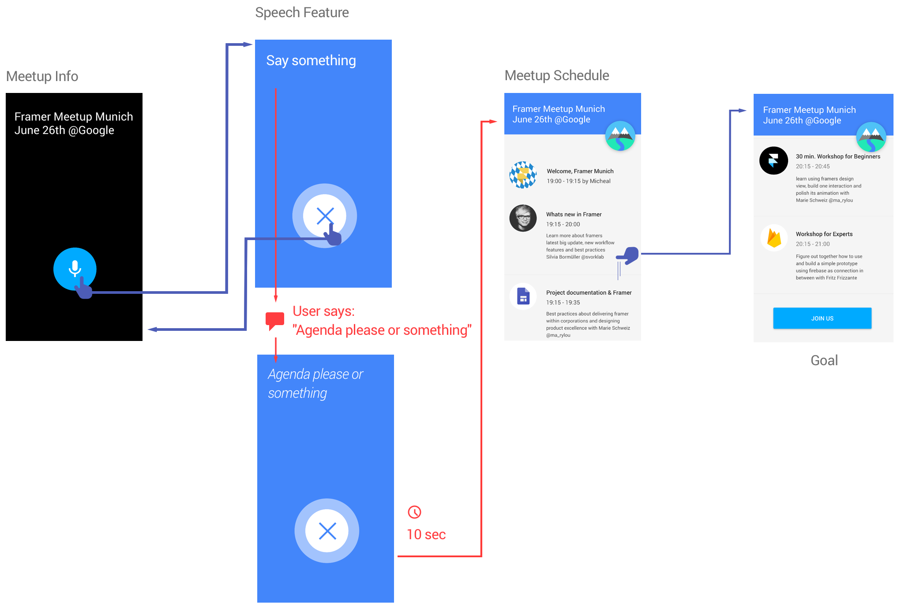

---
#
# You don't need to edit this file, it's empty on purpose.
# Edit minima's home layout instead if you wanna make some changes
# See: https://jekyllrb.com/docs/themes/#overriding-theme-defaults
#
layout: start
---

# What is "Framer MUC Agenda App" ?
**Objective:** Giving registered attendees of [Framer Munich Meetup](https://www.meetup.com/de-DE/meetup-group-framerjs-munich/) a sneek peak on what is happening on June 26th. Let new designers know how amazing interaction design can be. Serve as example on [why and how](why/) to documentate interaction design.

## Main concept

With only 3 views, all informations about the upcoming [Framer Munich Meetup](https://www.meetup.com/de-DE/meetup-group-framerjs-munich/), should be available and served interactive and enjoyable as Framer prototype. Information is structured by importance, so users have no trouble to get everything about the meetup with just two or three touches. 

1. Meetup Info: First priority is **What, When and where**, so users are able to figure out their availability. 

2. Speech Feature: A transition is charging users emotionally and **get them exited** about our upcoming meetup. (Feature transitions can highlight a meetup topic or sponsor)

3. Schedule overview: **information to empower their decision**

 

CONNECTED PROTOTYPE GOES HERE

### MVP definition
The first Prototype will cover the most important information for attendees and one featured animation:

* **What** (Framer Meetup Munich)
* **When** (June 26th)
* **Where** (at Google Germany)
* **What** is happening (Schedule)
* **Who** is speaking
* **Which** workshops are available
* **What** should every attendee bring

In Version 2, additional information could be useful:

* Hashtag usage ( e.g. #FramerMUC )
* Speaker information
* Sponsor information
* Workshop details & follow up information

### User group

Munich based designer with or without coding background. Interested in interaction design and product documentation. 

**Goals:** "learning more about framer", "level up their career profile" or "join the animation movement"

**Painpoints:** "Not being able to code", "Social awkwardness" and "company regulations"

**Userstory:** Annie has never wrote code before but she is used to designing mobile applications. Her colleagues demanding more detailed animations and **She wants** to create them in time **so that** her product becomes more polished.

**Jobstory: When a user** has limited ressources, time and doesn't want to spend money or too much time yet, **he has to** go to a meetup and see what other designers are doing, **so he can** decide for himself about learning or investing time in framer.

#### Exemplary Userjourney

 

## Features

Documentation Note: depending on your project size or complexity it might be suitable to have for each feature one document. When splitted i'm not going through a couple of definitions again

* Objective
* MVP or Version
* Appearance (where is it anchored in your mental model)
* Scenario 1
* Scenario 2
* Scenario 3... and so on...

### Meetup information

<iframe class="prototype-right" src="https://framer.cloud/Sickv"></iframe>

**Objective:** Inform potential attendees about what is happening (A meetup about framer) when (June 26th) and where (at google munich)

Scenario: As soon the App opens a button is offering speech input. By tapping our [feature animation](#feature-animation) is asking you to say something. Tapping the voice button will activate it and its starts pulsing. The pulse has to be visible enough to get attention but should [not trigger emotions such as stress or hurry](https://marieschweiz.github.io/ixd-documentation/misc/2017/06/13/thefirsttest.html#1-framer-meetup-information). A calming mindset is recommended.

Our [test confirmed](https://marieschweiz.github.io/ixd-documentation/misc/2017/06/13/thefirsttest.html#1-framer-meetup-information), one button works just fine!

### Feature animation

<iframe class="prototype-right" src="https://framer.cloud/QElto"></iframe>
**Objective:** give users attendees a sneek peak about what framer can archive.

Scenario: A User say's something and the speech recognition will display what he said, wait for 10 seconds and provide the schedule overview.

Speech recognition is a highly demanded feature and framer is able to do that. Googles speech Api can be accessed via framer and listen to a users voice. [Example for Google Voice input](https://github.com/baiIey/framer-speech-api) Framer wrote also an article about how to [build Speech recognition](https://blog.framer.com/prototyping-speech-recognition-in-framer-js-9cbbbd01757)

To be tested: By letting them go through with any specific voice input, framer is just showing off. Our theory: accuracy isn't neccessary to engage a user.

### Schedule Overview

<iframe class="prototype-right" src="https://framer.cloud/EXpCI"></iframe>
**Objective:** Let the user read and decide fast about the meetups schedule and content and what he is interested in or should he/she join at all.

Scenario: Has a user said something, the meetup schedule will slide in. A scrollview allows them to explore the whole meetup and its content.

To be tested: Is a short workshop description enough to convince a user to join or should it be more detailed. Will users understand the necessarity of a macbook?

## Patterns

### Scrollable header

Objective: Giving a sponsor the prominent place of a fab we like to ecourage companies to host a Framer Meetup.

In a non scrolled state, the sponsor Button is looking prominent and big with 110 x 110 dp. Scrolling the list will minimize the button and move him to the right or left of the Top Bar.

## Deleriverables

The idea is to have a prototype available. By definition this project is in a published state. Other projects might not and measurements are in order.

### Measurements

