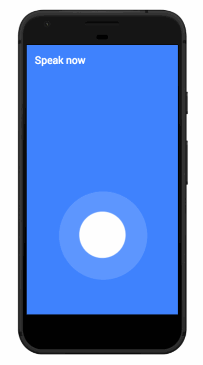

---
#
# You don't need to edit this file, it's empty on purpose.
# Edit minima's home layout instead if you wanna make some changes
# See: https://jekyllrb.com/docs/themes/#overriding-theme-defaults
#
layout: start
---

# What is "Framer MUC Agenda App" ?
**Objective:** Giving registered attendees of [Framer Munich Meetup](https://www.meetup.com/de-DE/meetup-group-framerjs-munich/) a sneak peak on what is happening on June 26th. Let new designers know how amazing interaction design can be. Serve as an example on [why and how](why/) to document interaction design.

## Main concept

<figure class="prototype-right">
<iframe src="https://framer.cloud/KkjHL" style="min-height:500px;width:100%;"></iframe>

<a href="https://framer.cloud/KkjHL" target="_blanc" style="display:block;text-align:center;">Open in new tap</a>
</figure>

With only 3 views a Framer prototype will inform about the upcoming [Framer Munich Meetup](https://www.meetup.com/de-DE/meetup-group-framerjs-munich/) and will be enjoyable as a Framer prototype. Information will be structured by importance, so users can get everything about the meetup with just two or three touches.

1. **[Meetup Information](#meetup-information):** First priority is **What, When and Where**. Users should be able to figure out their availability. 

2. **[Feature animation](#feature-animation):** A Speech recognition is charging users emotionally and **getting them exited** about the meetup. (Feature transitions can highlight a meetup topic or sponsor)

3. **[Schedule Overview](#schedule-overview):** **information to empower their decision**

 


### MVP definition
The first prototype will cover the most important information for attendees and one featured animation:

* **What** (Framer Meetup Munich)
* **When** (June 26th)
* **Where** (at Google Germany)
* **What** is happening (Schedule)
* **Who** is speaking
* **Which** workshops are available
* **What** should every attendee bring

In Version 2, additional information could be useful:

* Hashtag usage ( e.g. #FramerMUC )
* Speaker information
* Sponsor information
* Workshop details & follow up information


### User group

Munich based designers with or without coding background. Interested in interaction design and product documentation. 

**User story:** Annie has never written code before but she is used to designing mobile applications. Her colleagues demand more detailed animations and **she wants** to create them in time **so that** her product becomes more polished.

**Job story: When a user** has limited resources, time and doesn't want to spend money or too much time yet, **he has to** go to a meetup and see what other designers are doing, **so he can** decide about learning or investing time in Framer.

**User needs:** "learning more about Framer", "level up their career profile" or "join the animation movement"

**User painpoints:** "Not being able to code", "Social awkwardness" and "company regulations"

Usecases: Feel free to add some

#### Exemplary Userjourney

 


## Features

A suggestion which structure I'm working with can be found here but in general a recommendation is to have a structure and keep it.

### Meetup Information


<figure class="prototype-right">

<caption>
    <a href="https://framer.cloud/KkjHL" target="_blanc">Open prototype</a>
</caption>
</figure>

**Objective:** Inform potential attendees about what is happening (a meetup about Framer) when (June 26th) and where (at Google Munich)

**Scenario:** As soon as the app opens a button is offering speech input. When tapping it, our [feature animation](#feature-animation) asks you to say something. Tapping the voice button will activate it and it starts pulsing. The pulse has to be visible enough to get attention but should [not trigger emotions such as stress or hurry](https://marieschweiz.github.io/ixd-documentation/misc/2017/06/13/thefirsttest.html#1-framer-meetup-information). A calming mindset is recommended.

**Our [test confirmed](https://marieschweiz.github.io/ixd-documentation/misc/2017/06/13/thefirsttest.html#1-framer-meetup-information)**, one button works just fine! Start screen is a bit boring.

#### Measurements

* Title is written in 26 sp
* Background color is #000 or rgba(0,0,0,1)
* Voice Button is 110 x 110 dp centered

### Feature Animation
<figure class="prototype-right">

<a href="https://framer.cloud/KkjHL" target="_blanc">Open prototype</a>
</figure>
**Objective:** give users and attendees a sneak peak about what Framer can achieve.

Speech recognition is a highly demanded feature and Framer is able to do that. A browsers speech api ([W3c Statement](https://dvcs.w3.org/hg/speech-api/raw-file/tip/speechapi.html) on speech specification) can be accessed via Framer and listen to a user's voice. [Example for Google Voice input](https://github.com/baiIey/framer-speech-api) Framer wrote also an article about how to [build Speech recognition](https://blog.framer.com/prototyping-speech-recognition-in-framer-js-9cbbbd01757)

**Scenario:** A user says "hello" and the speech recognition will display what they said, wait for 10 seconds and provide the schedule overview.


**To be tested:** By letting them go through with any voice input, Framer is just showing off. Our theory: accuracy isn't necessary to engage a user.

#### Measurements

Pulsing circle animation is the inner circle scaled by 2. 

```
time: 2
curve: "easeOut"
```

### Schedule Overview

<figure class="prototype-right">

<a href="https://framer.cloud/KkjHL" target="_blanc">Open prototype</a>
</figure>
**Objective:** Let the user read and decide fast about the meetup's schedule and content and what they are interested in or whether they should join at all.

**MVP:** Just a listview with a schedule. Version 2 could offer detailed information on talks and speakers.

**Scenario:** Has a user said something, the meetup schedule will slide in. A scrollview allows them to explore the whole meetup and its content. A shrinking and [scrollable header pattern](#scrollable-header) is giving more screen space to read.

**Scenario:** Is a user tapping on the little sponsor logo (#isarvalley) a website will open a link provided by the sponsor.

**To be tested:** Is a short workshop description enough to convince a user to join or should it be more detailed? Will users understand the necessity of a macbook?


## Patterns

### Scrollable header

**Objective:** Encourage companies to host a Framer Meetup by giving a sponsor the prominent place of a fab.

In a non scrolled state, the sponsor button is looking prominent and big with 110 x 110 dp. [Scrolling a list](#schedule-overview) will minimize the button and move it to the right or left of the top bar.


<figure class="figureleft">
 
<caption>Header in its default state</caption>
</figure>

<figure class="figureleft">
 
<caption>Header as soon you scroll it</caption>
</figure>


## Deliverables

The idea is to have a prototype available for sharing. By definition this project is in a published state if a Framer prototype is available:

* As [URL via framercloud](https://framer.cloud/yrtrK)
* As [GIF for social media advertising](materials/Sayitwithframer3.gif)
* As [documentation](#)


